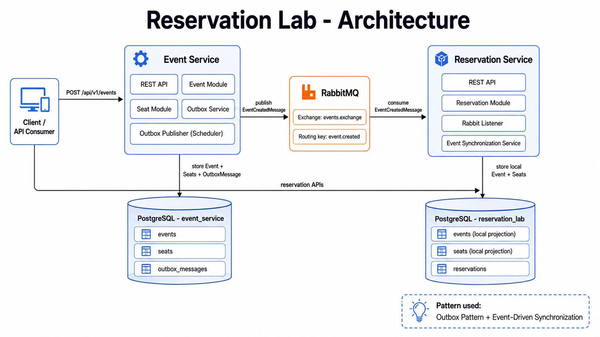
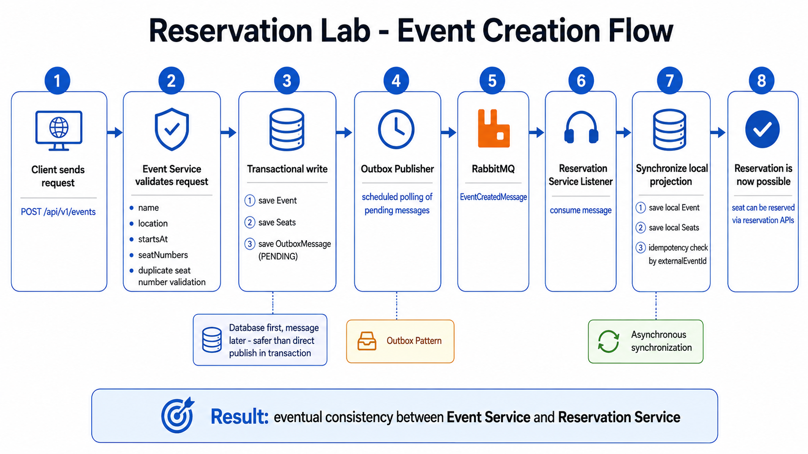

```md
## Architecture



The system consists of two services: Event Service and Reservation Service. Event Service owns events and seats, stores messages in the outbox table, and publishes them asynchronously to RabbitMQ. Reservation Service consumes event messages and stores a local projection of events and seats needed for reservations.

## Event creation flow



Event creation uses the Outbox Pattern. The event, seats, and outbox message are stored in one database transaction. A scheduled outbox publisher later sends the pending message to RabbitMQ. Reservation Service consumes the message and synchronizes its local event and seat projection.
```
